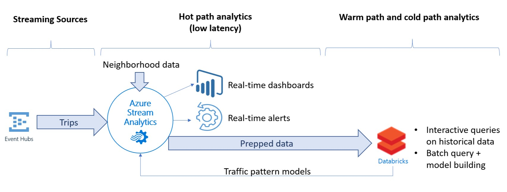
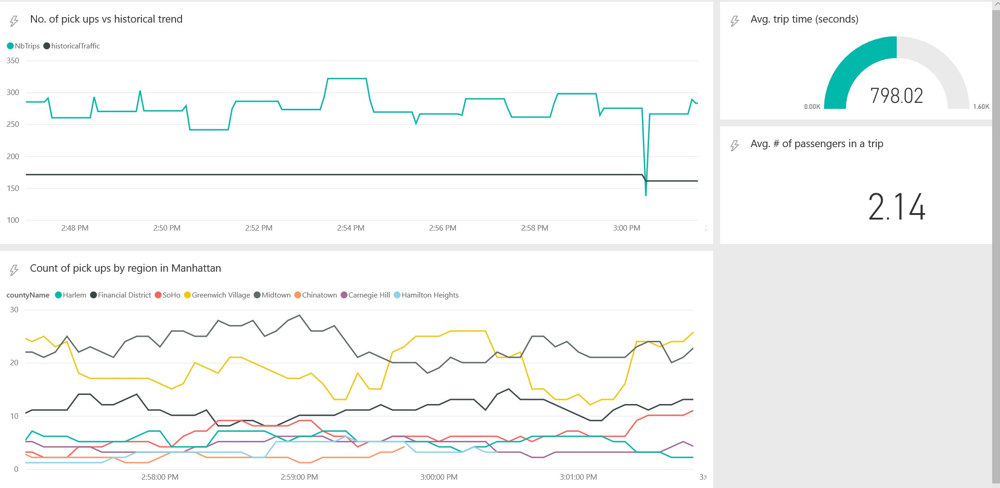

# Stream processing with Azure Stream Analytics

This project has a modified version of the simulator to read historical NYC taxi data and adjust it to current timestamp to do real time processing with Azure Stream Analytics.

This reference architecture shows an end-to-end stream processing pipeline. The pipeline ingests data from Trip Data Event Hub (Fare Data is also available if you want to play with it) and performs Geospatial Analytics.



The deployment uses [Azure Building Blocks](https://github.com/mspnp/template-building-blocks/wiki) (azbb), a command line tool that simplifies deployment of Azure resources.

After following the instructions to get the simulator running, you have to update the query and add new PBI outputs. This is described in the last section of this readme.

## Deploy the solution 

### Prerequisites

1. Clone, fork, or download the zip file for this [repository](https://github.com/sidramadoss/reference-architectures).

2. Install [Azure CLI 2.0](https://docs.microsoft.com/cli/azure/install-azure-cli?view=azure-cli-latest).

3. Install the [Azure building blocks](https://github.com/mspnp/template-building-blocks/wiki/Install-Azure-Building-Blocks) npm package.

   ```bash
   npm install -g @mspnp/azure-building-blocks
   ```

4. From a command prompt, bash prompt, or PowerShell prompt, sign into your Azure account as follows:

   ```bash
   az login
   ```

### Download the source data files

1. Create a directory named `DataFile` under the `data/streaming_asa` directory in the GitHub repo.

2. Open a web browser and navigate to https://uofi.app.box.com/v/NYCtaxidata/folder/2332219935.

3. Click the **Download** button on this page to download a zip file of all the taxi data for that year.

4. Extract the zip file to the `DataFile` directory.

    > This zip file contains other zip files. Don't extract the child zip files.

The directory structure should look like the following:

```
/data
    /streaming_asa
        /DataFile
            /FOIL2013
                trip_data_1.zip
                trip_data_2.zip
                trip_data_3.zip
                ...
```

### Deploy the Azure resources

1. From a shell or Windows Command Prompt, run the following command and follow the sign-in prompt:

    ```bash
    az login
    ```

2. Navigate to the folder `data/streaming_asa` in the GitHub repository

    ```bash
    cd data/streaming_asa
    ```

2. Run the following commands to deploy the Azure resources:

    ```bash
    export resourceGroup='[Resource group name]'
    export resourceLocation='[Location]'
    export cosmosDatabaseAccount='[Cosmos DB account name]'
    export cosmosDatabase='[Cosmod DB database name]'
    export cosmosDataBaseCollection='[Cosmos DB collection name]'
    export eventHubNamespace='[Event Hubs namespace name]'

    # Create a resource group
    az group create --name $resourceGroup --location $resourceLocation

    # Deploy resources
    az group deployment create --resource-group $resourceGroup \
      --template-file ./azure/deployresources.json --parameters \
      eventHubNamespace=$eventHubNamespace \
      outputCosmosDatabaseAccount=$cosmosDatabaseAccount \
      outputCosmosDatabase=$cosmosDatabase \
      outputCosmosDatabaseCollection=$cosmosDataBaseCollection

    # Create a database 
    az cosmosdb database create --name $cosmosDatabaseAccount \
        --db-name $cosmosDatabase --resource-group $resourceGroup

    # Create a collection
    az cosmosdb collection create --collection-name $cosmosDataBaseCollection \
        --name $cosmosDatabaseAccount --db-name $cosmosDatabase \
        --resource-group $resourceGroup
    ```

3. In the Azure portal, navigate to the resource group that was created.

4. Open the blade for the Stream Analytics job.

5. Click **Start** to start the job. Select **Now** as the output start time. Wait for the job to start.

### Run the data generator

1. Get the Event Hub connection strings. You can get these from the Azure portal, or by running the following CLI commands:

    ```bash
    # RIDE_EVENT_HUB
    az eventhubs eventhub authorization-rule keys list \
        --eventhub-name taxi-ride \
        --name taxi-ride-asa-access-policy \
        --namespace-name $eventHubNamespace \
        --resource-group $resourceGroup \
        --query primaryConnectionString

    # FARE_EVENT_HUB
    az eventhubs eventhub authorization-rule keys list \
        --eventhub-name taxi-fare \
        --name taxi-fare-asa-access-policy \
        --namespace-name $eventHubNamespace \
        --resource-group $resourceGroup \
        --query primaryConnectionString
    ```

2. Navigate to the directory `data/streaming_asa/onprem` in the GitHub repository

3. Update the values in the file `main.env` as follows:

    ```
    RIDE_EVENT_HUB=[Connection string for taxi-ride event hub]
    FARE_EVENT_HUB=[Connection string for taxi-fare event hub]
    RIDE_DATA_FILE_PATH=/DataFile/FOIL2013
    MINUTES_TO_LEAD=0
    PUSH_RIDE_DATA_FIRST=false
    ```
    Note that FARE EVENT HUB is still required by the simulator though it isn't used by the query.

4. Run the following command to build the Docker image.

    ```bash
    docker build --no-cache -t dataloader .
    ```

5. Navigate back to the parent directory, `data/stream_asa`.

    ```bash
    cd ..
    ```

6. Run the following command to run the Docker image.

    ```bash
    docker run -v `pwd`/DataFile:/DataFile --env-file=onprem/main.env dataloader:latest
    ```

### Update Query for geospatial analytics:
```--SELECT all relevant fields from TaxiRide Streaming input
WITH 
TripData AS (
    SELECT TRY_CAST(pickupLat AS float) as pickupLat,
    TRY_CAST(pickupLon AS float) as pickupLon,
    passengerCount, TripTimeinSeconds, 
    pickupTime, VendorID
    FROM TaxiRide timestamp by pickupTime
    WHERE pickupLat > -90 AND pickupLat < 90 AND pickupLon > -180 AND pickupLon < 180
),

--Calculate distance from drop off point to MSFT store in Times Square
PickupRegionData AS(
    SELECT CreatePoint(pickupLat,pickupLon) as pickup,  ST_DISTANCE(CreatePoint(pickupLat,pickupLon) ,CreatePoint(40.762,-73.981)) as distance
    FROM TripData
)

-- # of pickups near MSFT store in times square
SELECT count(*) as pickups, system.timestamp as timestamps
INTO pbimsft
FROM PickupRegionData
WHERE distance < 500
Group by hoppingwindow(second,60,5)

--Grouping by regions in Manhattan
SELECT RegionReferenceData.Name AS countyName, count(*), system.timestamp as timestamps
INTO pbicounty
FROM TripData
JOIN RegionReferenceData ON 
ST_WITHIN(CreatePoint(TripData.pickupLat, TripData.pickupLon), RegionReferenceData.geometry) = 1
Group by RegionReferenceData.Name, hoppingwindow(second,60,5)

-- Output to Blob / Data lake aggregated at the minute level. Used for batch processing in Databricks
SELECT count(*) as NbTrips, avg(passengerCount) as AvgPassenger, avg(TripTimeinSeconds) as TripTimeinSeconds, system.timestamp as timestamps
INTO DataLake
FROM TripData Group By VendorId,tumblingwindow(minute,1)

--Compare Traffic with historical values in reference data
SELECT count(TripData.VendorID) as NbTrips, avg(TripData.passengerCount) as AvgPassenger, avg(TripData.TripTimeinSeconds) as TripTimeinSeconds, System.Timestamp as timestamps, TRY_CAST(HistoricalTrafficData.avgTraffic as bigint) as historicalTraffic
INTO PBI
FROM TripData
JOIN HistoricalTrafficData ON
datepart(hour,TripData.pickupTime) = TRY_CAST(HistoricalTrafficData.hour as bigint)
Group By TripData.VendorID, HistoricalTrafficData.avgTraffic, hoppingwindow(second,60,5)
```
Links for reference data:
1. [HistoricalTrafficData](https://forresterdemoblobop.blob.core.windows.net/referencedata/avgtraffic.csv)
2. [RegionReferenceData](https://forresterdemoblobop.blob.core.windows.net/referencedata/manhattan-ny.json)
<br>You can copy these two files over to your reference data stores and use it in your ASA job.

Let the program run for around 15 minutes after which you should start seeing output. You can see the output of the Stream Analytics job in a PowerBI dashboard.

